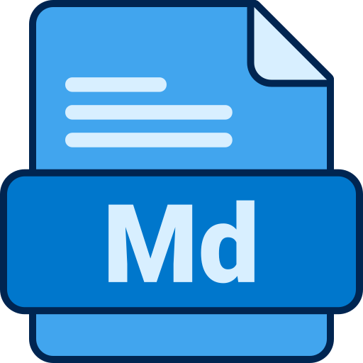

## Project title
### Week-1 | Session-1 | Assignment 

<!-- ## Motivation -->

<!-- ## Build status -->

<!-- ## Code style -->
 
<!-- ## Screenshots -->
---
## Tech/framework used

---

<!-- ## Features -->

<!-- ## Code Example -->

<!-- ## Installation -->

<!-- ## API Reference -->

<!-- ## Tests -->

## How to use?
**File Structure**
Session-01
|----> Assignment.md  (Questions)
|----> Assignment_Solution.md (Questions + Answers)
|----> Instructions.md (How to perform the Assignemnt?)
|----> Resources.md (Supportive resources to complete the assignemnt)

---
<!-- ## Contribute -->

<!-- ## Credits -->

## License

MIT © [Dwij Mistry](https://dwij.tech)